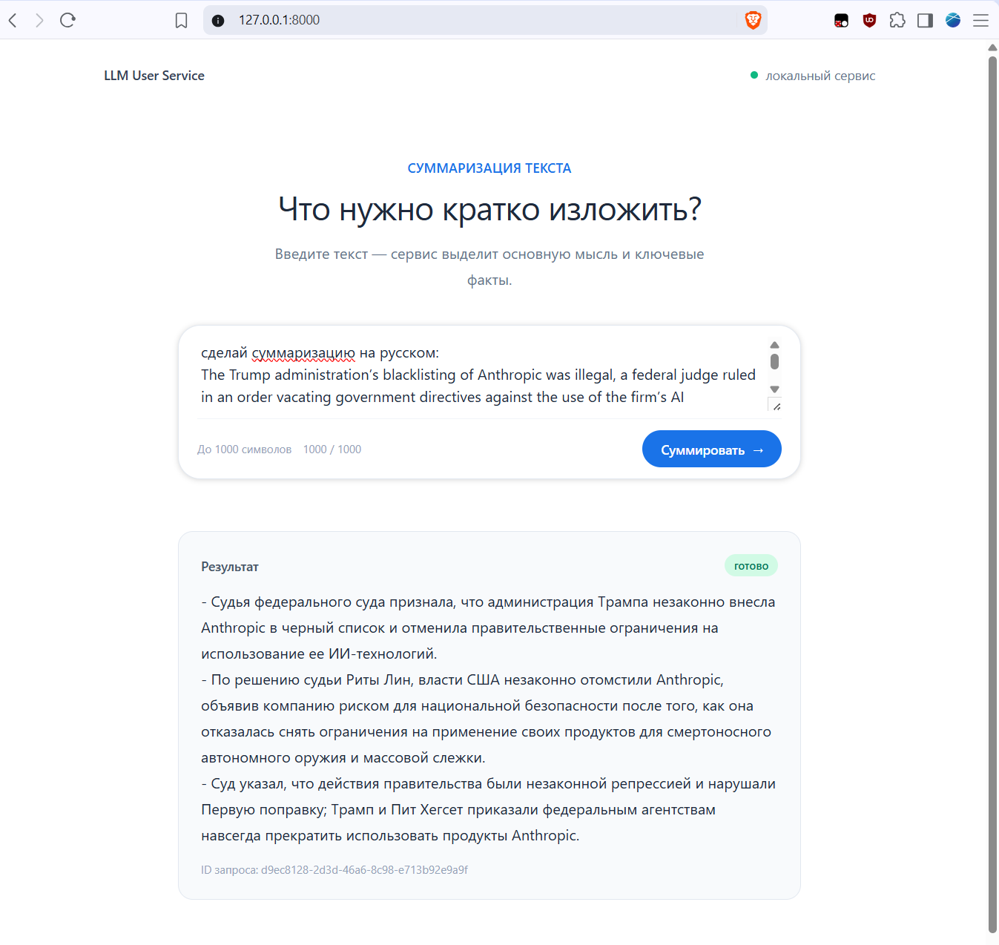
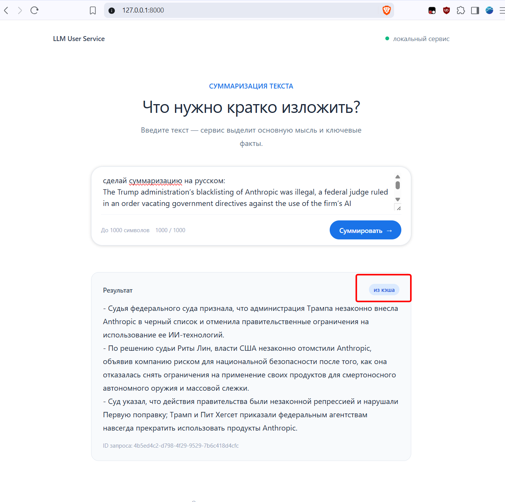

# LLM User Service

Локальный сервис суммаризации текста с веб-интерфейсом, API, TTL-кэшем, fallback-ответом и структурированным логированием.

## Скриншоты

Снимки сделаны в режиме `LLM_MODE=stub`; сценарии `400` и `503` проверены командами выше.






## Требования

- Python 3.10+
- [uv](https://docs.astral.sh/uv/)
- CLIProxy для режима `auto`

## Установка

```powershell
uv sync
Copy-Item .env.example .env
```

Параметры задаются в `.env` или переменными окружения. Токен передаётся только через `CODEX_CLI_TOKEN` и не хранится в проекте.

## Запуск

```powershell
uv run python main.py
```

Доступны Web UI: <http://127.0.0.1:8000/>, Swagger UI: <http://127.0.0.1:8000/docs>, Health: <http://127.0.0.1:8000/health>.

Интерфейс использует Tailwind CSS через CDN и не требует отдельной frontend-сборки.

## Конфигурация

| Переменная | По умолчанию | Назначение |
| --- | --- | --- |
| `LLM_MODE` | `auto` | `auto` (алиас `proxy`) для CLIProxy, `stub` для локальной заглушки |
| `LLM_BASE_URL` | `http://127.0.0.1:8317/v1` | Базовый URL CLIProxy |
| `LLM_MODEL` | `gpt-5.4-mini` | Модель по умолчанию |
| `LLM_TEMPERATURE` | `0.2` | Temperature запроса |
| `LLM_TIMEOUT_SECONDS` | `15` | Таймаут одного вызова |
| `LLM_MAX_RETRIES` | `2` | Число повторов временных ошибок |
| `LLM_RETRY_BASE_DELAY` | `0.25` | Базовая задержка экспоненциального повтора, секунд |
| `CACHE_TTL_SECONDS` | `600` | Время жизни записи кэша |
| `LOG_FILE` | `logs/service.jsonl` | Путь к JSONL-файлу журнала |
| `SYSLOG_HOST` | пусто | Адрес syslog-сервера; пусто — функция выключена |
| `SYSLOG_PORT` | `514` | Порт syslog-сервера |
| `SYSLOG_PROTOCOL` | `udp` | `udp` или `tcp` |
| `SYSLOG_FACILITY` | `local0` | Syslog facility |

## API

`POST /chat` принимает JSON с обязательным `message` длиной от 1 до 1000 символов.

```powershell
$body = @{ message = "В понедельник команда согласовала цели проекта, а во вторник подготовила план релиза." } | ConvertTo-Json -Compress
curl.exe -sS -X POST "http://127.0.0.1:8000/chat" -H "Content-Type: application/json" -d $body
```

Пример ответа:

```json
{
  "response": "Краткое резюме: ...",
  "cached": false,
  "fallback": false,
  "request_id": "..."
}
```

Успешный ответ содержит `response`, `cached`, `fallback` и `request_id`. Ошибки ввода возвращаются со статусом `400`; недоступность модели — со статусом `503` и `fallback: true`. Успешные одинаковые запросы кэшируются на срок `CACHE_TTL_SECONDS` (по умолчанию 10 минут) с учётом текста, модели, temperature и системного prompt.

## Проведенные ручные тесты

Команды выполняются из корня проекта. Сервер запускается в отдельном окне PowerShell.

Чек-лист:

- [x] корректный запрос и ответ заглушки;
- [x] повторный запрос из TTL-кэша;
- [x] отсутствующее, пустое и слишком длинное поле `message`;
- [x] fallback и ограниченные retry при недоступной модели;
- [x] отправка событий по UDP и TCP syslog;
- [x] загрузка Web UI, `/health` и `/docs`.

# Ручной отчёт о проверке

Проверки выполнены 29.08.2026 из корня проекта.

| Сценарий | Команда из README | Ожидаемый результат | Фактический результат |
| --- | --- | --- | --- |
| Заглушка | Успешный `POST /chat` при `LLM_MODE=stub` | `200`, `cached: false` | `200`, `cached: false`, ответ получен |
| Кэш | Повторный одинаковый запрос | `200`, `cached: true`, cache hit в логах | `200`, `cached: true`, `cache_lookup: hit` |
| Нет `message` | `POST /chat` с `{}` | `400` | `400` |
| Невалидный JSON | `POST /chat` с `not-json` | `400` | `400`, понятное сообщение валидации |
| Пустое сообщение | `message` из пробелов | `400` | `400`, понятное сообщение валидации |
| Длинное сообщение | `message` длиной 1001 символ | `400` | `400` |
| Сбой модели | Недоступный `LLM_BASE_URL` | `503`, `fallback: true`, retry в логах | `503`, `fallback: true`, 2 события `llm_retry` и событие `llm_error` |
| Syslog UDP | `SYSLOG_HOST=127.0.0.1`, `SYSLOG_PROTOCOL=udp` | JSON-событие в UDP-пакете | Пакет получен; событие `request_received`; стандартная syslog-обёртка `<134>` |
| Syslog TCP | `SYSLOG_HOST=127.0.0.1`, `SYSLOG_PROTOCOL=tcp` | JSON-событие в TCP-потоке | Подключение принято; событие `syslog_configured` получено с `<134>` |
| Web UI | Тестовый запрос через `/` | Ответ и состояние кэша видны в интерфейсе | Снимки `docs/screenshots/chat-success.png` и `docs/screenshots/chat-cache.png` |

Токены и HTTP-заголовки в проверочных данных не сохранялись.

### Успех и кэш

```powershell
$env:LLM_MODE="stub"
uv run python main.py
```

```powershell
$body = @{ message = "В понедельник команда согласовала цели проекта, а во вторник подготовила план релиза." } | ConvertTo-Json -Compress
curl.exe -sS -i -X POST "http://127.0.0.1:8000/chat" -H "Content-Type: application/json" -d $body
curl.exe -sS -i -X POST "http://127.0.0.1:8000/chat" -H "Content-Type: application/json" -d $body
Get-Content .\logs\service.jsonl -Tail 20
```

Ожидается: первый ответ `200` с `cached: false`, второй `200` с `cached: true`, в логах — `cache_lookup` со значением `hit`.

### Валидация

```powershell
curl.exe -sS -i -X POST "http://127.0.0.1:8000/chat" -H "Content-Type: application/json" -d '{}'
$whiteBody = @{ message = "   " } | ConvertTo-Json -Compress
curl.exe -sS -i -X POST "http://127.0.0.1:8000/chat" -H "Content-Type: application/json" -d $whiteBody
$longBody = @{ message = ("x" * 1001) } | ConvertTo-Json -Compress
curl.exe -sS -i -X POST "http://127.0.0.1:8000/chat" -H "Content-Type: application/json" -d $longBody
curl.exe -sS -i -X POST "http://127.0.0.1:8000/chat" -H "Content-Type: application/json" -d 'not-json'
```

Ожидается `400` во всех случаях.

### Fallback и ретраи

```powershell
$env:LLM_MODE="auto"
$env:LLM_BASE_URL="http://127.0.0.1:9/v1"
$env:CODEX_CLI_TOKEN="manual-test-token"
uv run python main.py
```

```powershell
$body = @{ message = "Проверка fallback при недоступной модели." } | ConvertTo-Json -Compress
curl.exe -sS -i -X POST "http://127.0.0.1:8000/chat" -H "Content-Type: application/json" -d $body
Get-Content .\logs\service.jsonl -Tail 30
```

Ожидается `503`, `fallback: true`, события `llm_retry` и `llm_error`.

### Syslog

Перед запуском указать адрес принимающего сервера:

```powershell
$env:SYSLOG_HOST="127.0.0.1"
$env:SYSLOG_PORT="514"
$env:SYSLOG_PROTOCOL="udp"
uv run python main.py
```

```powershell
$body = @{ message = "Проверка отправки событий в syslog." } | ConvertTo-Json -Compress
curl.exe -sS -X POST "http://127.0.0.1:8000/chat" -H "Content-Type: application/json" -d $body
```

Каждое событие отправляется на указанный syslog-сервер как JSON-полезная нагрузка по UDP или TCP. `SysLogHandler` добавляет стандартную syslog-обёртку `<PRI>` (для facility `local0` — `<134>`). При пустом `SYSLOG_HOST` сетевой handler не создаётся; ошибки и недоступность отправки подавляются и не прерывают обработку запросов.

Для локальной проверки UDP можно запустить приёмник в отдельном окне:

```powershell
uv run python -c "import socket; s=socket.socket(socket.AF_INET,socket.SOCK_DGRAM); s.bind(('127.0.0.1',514)); print(s.recvfrom(65535)[0].decode('utf-8','replace'))"
```

Для TCP укажите `SYSLOG_PROTOCOL=tcp` и запустите приёмник:

```powershell
uv run python -c "import socket; s=socket.socket(); s.setsockopt(socket.SOL_SOCKET,socket.SO_REUSEADDR,1); s.bind(('127.0.0.1',514)); s.listen(1); c,_=s.accept(); print(c.recv(65535).decode('utf-8','replace')); c.close(); s.close()"
```

## Логи

JSON Lines формируются в консоли и `logs/service.jsonl`, а при настройке `SYSLOG_HOST` также отправляются по UDP или TCP на syslog. Записываются запросы, prompt, ответы, ошибки, cache hit/miss и длительность этапов. Токены и HTTP-заголовки не записываются.

